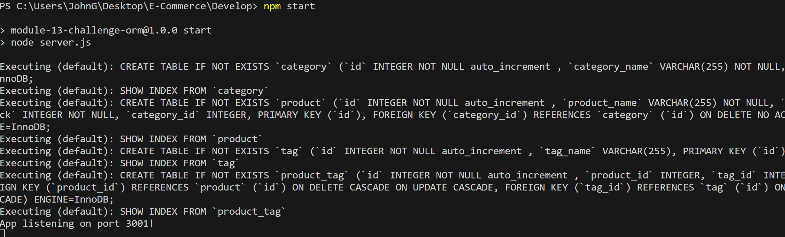

# E-Commerce

## Description
This projects code was written by myself with the assisstance of the GWU tutoring service. This application allows the user to add, delete, and view items to an online E-Commerce database, as well as add or delete categories, and change what categories items are in. 

## Installation:
This software requires the user to have access to Insomnia, Thunderclient, or another form of request creation software.

### Usage:

### The User will type npm start and be informed the server is running

### Any additional work must be seen in Thunderclient 

